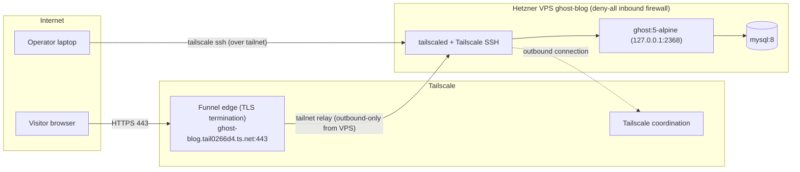

# Ghost on Hetzner — zero public inbound ports

One command deploys a [Ghost](https://ghost.org) blog on a Hetzner VPS that exposes **no open
ports on its public IP**. Administration (SSH) runs over [Tailscale SSH](https://tailscale.com/kb/1193/tailscale-ssh);
the blog is published to the internet with [Tailscale Funnel](https://tailscale.com/kb/1223/funnel),
which terminates TLS on Tailscale's edge and relays to the node over the tailnet.

Verified live on 2026-08-30: `nmap -Pn` against the public IPv4 showed 1000/1000 TCP ports
filtered while the blog served `HTTP/2 200` at its public Funnel URL.

## Architecture



The VPS only ever makes **outbound** connections (to the Tailscale network). The attached Hetzner
Cloud Firewall has zero inbound rules, which drops all inbound traffic — there is nothing to port-scan.

## Prerequisites

- [`hcloud`](https://github.com/hetznercloud/cli), `tailscale`, `envsubst`, `curl`, `openssl`,
  `python3` on your machine; your machine joined to your tailnet.
- Tailnet with [Funnel](https://tailscale.com/kb/1223/funnel) and
  [HTTPS certificates](https://tailscale.com/kb/1153/enabling-https) enabled.
- Environment variables (e.g. via a gitignored `.env`):
  - `HCLOUD_TOKEN` — Hetzner Cloud API token (read/write)
  - `TS_AUTHKEY` — Tailscale auth key
- The tailnet name (`tail0266d4.ts.net`) and Funnel URL are currently hardcoded in
  `deploy.sh`/`cloud-init.yaml`; adjust for your tailnet.

## Deploy

```sh
./deploy.sh
```

That's it. The script creates a deny-all firewall and a `cx23` server in `fsn1` whose entire setup
is cloud-init (there is deliberately no SSH path over the public IP), waits for the node to join
the tailnet and for Ghost to answer, then prints:

```
Blog:  https://ghost-blog.tail0266d4.ts.net
Admin: https://ghost-blog.tail0266d4.ts.net/ghost
SSH:   tailscale ssh root@ghost-blog
```

First deploy takes ~4 minutes. Re-running is safe: existing resources are left untouched
(note: cloud-init runs on first boot only — a server whose bootstrap failed needs
`./teardown.sh` first).

## SSH afterwards

```sh
tailscale ssh root@ghost-blog
```

No SSH keys, no public port 22 — authentication and encryption ride on your tailnet identity. If
your tailnet ACL's `ssh` rule uses `action: check` (the Tailscale default), the first connection
asks you to re-authenticate in a browser once per check period.

## Teardown

```sh
./teardown.sh
```

Logs the node out of the tailnet (best effort — the logout severs its own SSH session, so on a
race the node can linger; remove it in the Tailscale admin console if the script says so), then
deletes the server and the firewall. Idempotent; verify with
`hcloud server list && hcloud firewall list`.

## ADR: why Tailscale Funnel (and not Cloudflare Tunnel)

**Context.** Requirement: a publicly reachable blog on a VPS with zero public inbound ports, plus
SSH access for the operator — both through one tunnel provider.

**Decision.** Tailscale for both planes: Tailscale SSH for administration, Funnel for public HTTPS.

**Considered alternative: Cloudflare Tunnel** (`cloudflared`). Also gives outbound-only publishing
and would offer CDN/WAF in front. Rejected because it requires owning a domain whose DNS zone is
on Cloudflare — an external dependency and cost this project doesn't otherwise need. Tailscale
Funnel publishes on the tailnet's built-in `*.ts.net` name with automatic Let's Encrypt certs, and
the same agent already provides SSH, so one daemon covers both requirements.

**Trade-offs accepted.**
- Funnel is a TCP relay through Tailscale's edge: bandwidth-limited, no CDN/WAF — fine for a
  small blog, wrong for high traffic.
- The URL is a `ts.net` subdomain; a custom domain isn't possible with Funnel today.
- Vendor coupling: tailnet policy (Funnel node attribute, SSH ACLs, HTTPS certs) becomes part of
  the deployment's environment.
- The auth key is delivered via cloud-init user-data, which remains readable from the instance
  (root-only files and the cloud metadata service) for the server's lifetime. Use a short-expiry,
  ideally single-use key; a compromised blog container is on the same host as a valid node key.

## Repository layout

| File | Purpose |
|---|---|
| `deploy.sh` | preflight → deny-all firewall → server with cloud-init → wait → print URL |
| `cloud-init.yaml` | template (envsubst): Tailscale (SSH) → Docker → Ghost+MySQL → Funnel |
| `teardown.sh` | tailnet logout (best effort) → delete server → delete firewall |
| `docs/plan.md` | implementation plan and acceptance criteria |
